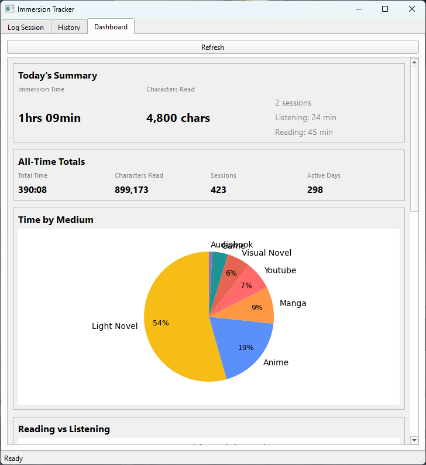

# imaa-tracker

<picture>
    
</picture>

A desktop application for tracking Japanese language immersion and study.

Because spreadsheets weren't cutting it — **_imaa_** lets you log more than 
just the minutes. 
- 11 media types, reading vs listening vs both, and character count
- Optional metrics like the number of pages, number of episodes, even text direction
- Specific content details such as volume/chapter, episode names, URLs, notes
- Saves all media titles to your collection
- Plus a dashboard full of insightful charts to visualize your progress over time

## Contents
- [Project Overview](#overview)
- [Development Roadmap](#project-status)
- [Quick Start](#quick-start)

## Overview
### Screenshots
<table>
  <tr>
    <td></td>
    <td></td>
  </tr>
  <tr>
    <td align="center"><b>Log and view your sessions</b></td>
    <td align="center"><b>Stopwatch auto-fills Log Form</b></td>
  </tr>
  <tr>
    <td></td>
    <td></td>
  </tr>
  <tr>
    <td align="center"><b>Filter through your past logs</b></td>
    <td align="center"><b>View your stats</b></td>
  </tr>
<!--
  <tr>
    <td></td>
    <td></td>
    <td></td>
  </tr>
  <tr>
    <td align="center"><b>Log Immersion Sessions</b></td>
    <td align="center"><b>View/Edit Past Logs</b></td>
    <td align="center"><b>Many ways to view your stats!</b></td>
  </tr>
-->
</table>

### Tech Stack
- **Python 3.9+** with PyQt6 for the desktop GUI
- **SQLite** (via Python's built-in `sqlite3`) for local data persistence
- **pandas** and **numpy** for data aggregation and analysis
- **matplotlib** and **pyqtgraph** for data visualization
- **openpyxl** for spreadsheet import/export
### Project Structure
```
imaa-tracker/
├── scripts/ 
│   ├── __init__.py    
│   ├── demo.json
│   ├── demo_to_db.py       # Fills db with demo data from demo.json
│   ├── generate_demo.py    # Generates demo.json
│   └── sheets_to_db.py     # Migrates logs from immersion_log.xlsx to db
├── tests/   
│   ├── __init__.py
│   └── test_repo.py    # tests for repository layer
├── widgets/   
│   ├── __init__.py
│   ├── log_form.py         # Log Form tab
│   ├── stopwatch.py
│   ├── session_table.py    # Session History tab
│   ├── dashboard.py        # Dashboard tab
│   ├── charts_mpl.py
│   └── charts_pyqtgraph.py
├── app.py 
├── imaa_tracker.db     # Not tracked in git
├── db.py  
├── repo.py             # repository layer (db queries)
├── requirements.txt    # Python dependencies
└── README.md
```

## Project Status
### Phase 1: Core MVP ✅
- [x] Immersion session logging form
- [x] Stopwatch
- [x] Session history table (w/ filters)
- [x] Simple data visualization dashboard

### Phase 2: UX Fixes & Enhanced Functionality
- [ ] Dashboard snapshot export
- [x] Session editing
- [ ] Dashboard filters
- [ ] More charts
- [ ] Write tests for dashboard features

_**I will be releasing a packaged build at this point. Stay tuned!**_

### Phase 3: Advanced Tracking Features
- [ ] Goals system UI
- [ ] Media management UI
- [ ] API integration
- [ ] User preferences

### Phase 4: Study Tracking
- [ ] Study sessions log and resources
- [ ] Exam scores tracking
- [ ] Multi-language tracking


## Quick Start
**Prerequisites**
- Python 3.9+

**1. Clone the repository:**
```bash
git clone https://github.com/oskeii/imaa-tracker.git
cd imaa-tracker
```
**2. Install dependencies:**
```bash
# Set up virtual environment
python -m venv .venv
source .venv/bin/activate      # Windows: .venv\Scripts\activate

# Install dependencies from requirements.txt
pip install -r requirements.txt
```

**3. Start application:**
```bash
python app.py
# Optional: load demo data to see the app with populated charts
python -m scripts.demo_to_db scripts/demo.json
```


## Contributing
This is a personal project, but suggestions are welcome! Open an issue if you find bugs or have feature ideas.

## License
